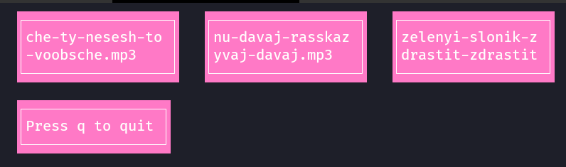

# zap-cli



The CLI app for playing MP3 sounds from folder.

## Build

```build
go build zap-cli.go
```

## Usage

```bash
$ ./zap-cli -h                                                                                                                                      11:04:28
Usage of ./zap-cli:
  -dir string
        Directory to scan. (default "./")

$ ./zap-cli -dir ~/Sounds
```
